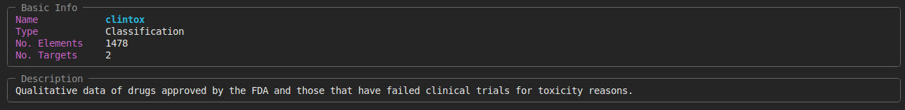

# ``info`` - Show Dataset Metadata

You can use the ``info`` command to view all the metadata associated with a specific dataset by supplying the 
unique string identifier of the corresponding dataset (see [List Available Datasets](cli_list.md))

```bash
cmdata info "clintox"
```

This will print a detail view as shown below. The detailed view about the dataset, for example, contains 
information about the number of elements it contains, the type of task it presents (regression/classification) 
and the description.

