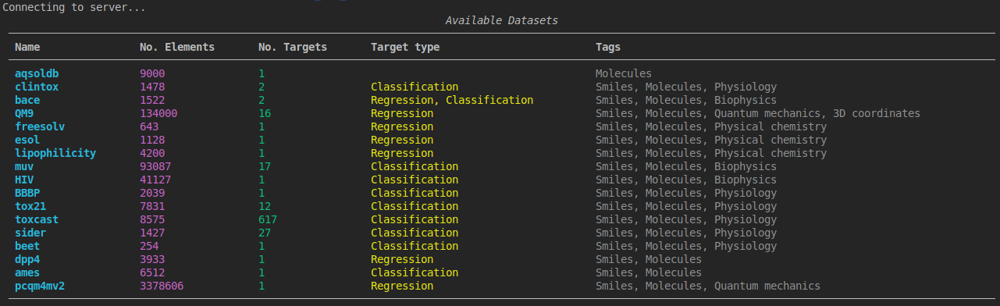

# ``list`` - List Available Datasets

You can use the ``list`` command to print a list view of all the datasets which are available on the 
remote file share server:

```bash
cmdata list
```

This will create a list view as shown below, where each dataset is identified by a unique string name (first column) and 
some additional information.


