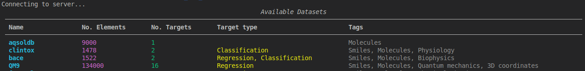

# First Steps

## Command Line Interface (CLI)

After installing the ``chem_mat_data`` package, you should have access to the ``cmdata`` command line interface which 
allows to interact with the remote file share server to, for example, list all the available datasets or to download 
them into a local directory.

### Help Option

You can use the ``--help`` option to get a list of all the available commands:

```bash
cmdata --help
```

### Simple Commands

To view a list of all the available datasets on the remote file share server, you can use the ``list`` command:

```bash
cmdata list
```

This command will produce a list view as shown below



You can then use the ``download`` command to download one of the datasets by using its unique string name:

```bash
cmdata download "clintox"
```

This command will, for example, download a raw ``clintox.csv`` file into the current working directory. This raw 
CSV dataset format consists of a list of SMILES molecule representations and their corresponding target value 
annotations - in this case a classification label of the molecules *toxicity*.

## Programming Interface (API)

Alternatively, the ``chem_mat_data`` functionality can be used programmatically as part of python code. The 
package provides each dataset either in **raw** or **processed/graph** format (For further information on the 
distincation visit the [Loading Datasets](api_datasets.md)) documentation.

### Raw Datasets

You can use the ``load_smiles_dataset`` function to download the raw dataset format. This function will 
return the dataset as a ``pandas.DataFrame`` object which contains a "smiles" column along with the specific 
target value annotations as separate data frame columns.

```python
import pandas as pd
from chem_mat_data import load_smiles_dataset

df: pd.DataFrame = load_smiles_dataset('clintox')
print(df.head())
```

### Graph Datasets

You can also use the ``load_graph_dataset`` function to download the same dataset in the *pre-processed* graph 
representation. This function will return a list of ``dict`` objects which contain the full graph representation 
of the corresponding molecules.

```python
from rich.pretty import pprint
from chem_mat_data import load_graph_dataset

graphs: list[dict] = load_graph_dataset('clintox')
example_graph = graphs[0]
pprint(example_graph)
```

For more details on the structure of this graph representation, please refer to the 
[Graph Representation](graph_representation.md) documentation.

(Insert an example of how to train a PyG model with this representation)